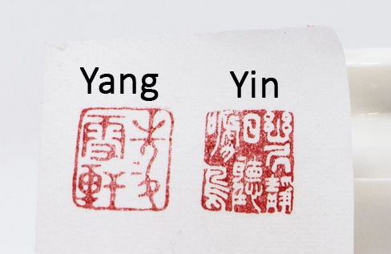
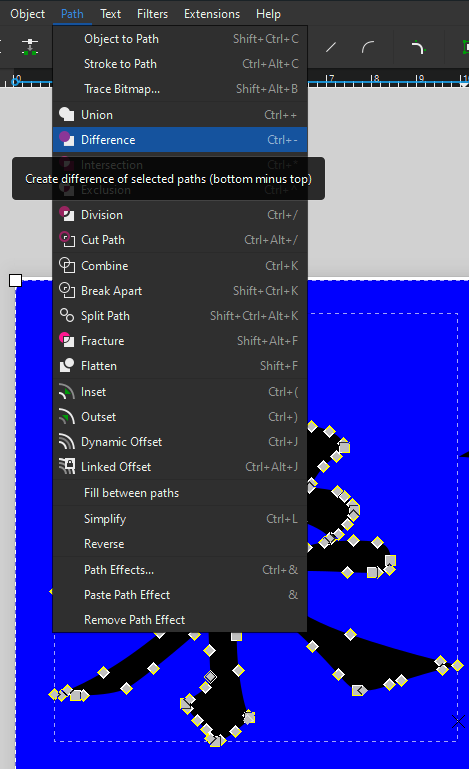
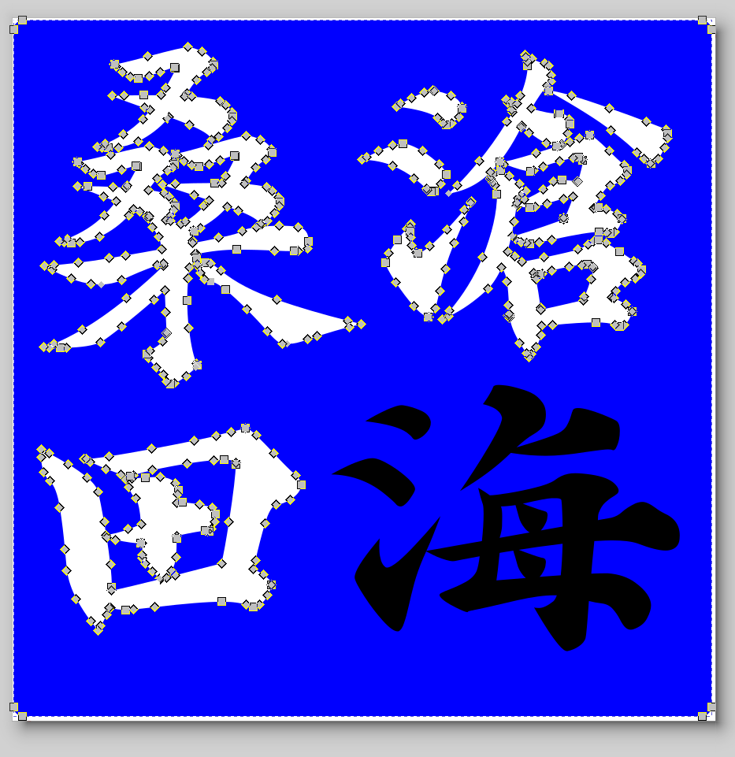
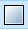
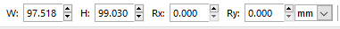
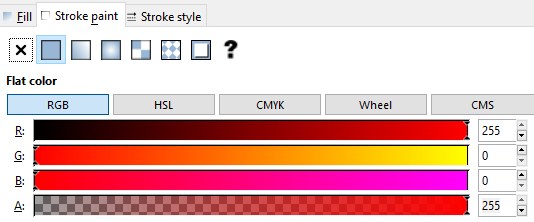

# Bonus: Change your design from Yin to Yang design 

The initial stages of the activities if left as-is would result in a design that is engraved out of the surface (Yin) with the black part of the design burned away from the wood and the white part of the background left raised to be inked. This activity will teach you how you reverse the artwork so that the design itself will be left as a raised surface (Yang) and the area around it will be burned away. If you and your group have any questions or get stuck as you work through this exercise, please ask the instructor for assistance.  Have fun!
 
1. Open your design from the end of Activity 4
- Select either the Rectangle Tool or the Ellipse/Arc tool from the right side menu and make a solid shape behind your design.
- You may need to open the Layers and Objects tab to move the shape to the bottom of the design  
- Select one of your design elements and the new shape you just created and then go to the Path menu in the top bar menu and click on Difference. 
 
- Repeat this process with all of your design elements until you have successfully cut them out of the shape you created.
-  
- Click on the completed shape to select it, and then click on the colour black in the bottom colour bar to turn the shape black.
- If you already have a red stroke line in your design from the previous activity, you can just align the shapes to your liking. Remember that any white area of the design will be raised and inked. 

2. If you need a cut line: Adding a cut line for your seal
- Let's add a cut line around your design, so that the laser knows where to cut your seal.
-  Click on the **create rectangles and squares** icon from the left side toolbar  
 - Click and drag somewhere on the canvas to create a rectangle. In the top left corner there’s a toolbar that looks like this:   
 - Make sure the units are in **mm**.
 - Change the width (W) and height (H) to **20**.  You should now have a 20mm x 20mm square shape.
 - Change the x-radius (Rx) and y-radius (Ry) to **1**.  This determines how rounded the corners of your square are.
 -  - Click on the **Object** drop-down menu and select **Fill and Stroke**. A tool on the right side of the screen should pop-up.  
 - In the **Fill** tab, change the fill from Flat colour to No paint.
 - Click over to the **Stroke paint** tab. Select **Flat colour**. The vector cutting colour is a specific red in the laser software. In the RGB colour selection, Change the red (R) value to 255 and change the green (G) and blue (B) values to 0. 
 - Click over to the **Stroke style** tab. Change the Width to 0.1 mm. This is to ensure the line is thin enough to show up as a vector line in the laser software. Sometimes if lines are too thick then they’re interpreted as raster objects.  

- **Save** before continuing to make sure you don’t lose the progress in your work.
- Click File, then Save As… to save your file. Rename if desired.

[NEXT STEP: Requesting a Laser Cut Seal with a 3D Printed Handle](request.html){: .btn .btn-blue }
OR
[NEXT STEP: Earn a Workshop Badge](informal-credentials.html){: .btn .btn-blue }
