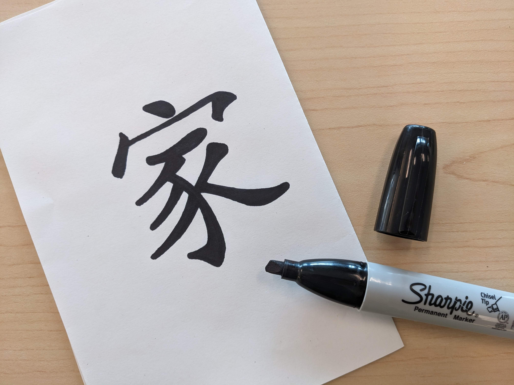

# Creating Your Seal Art

If you and your group have any questions or get stuck as you work through this exercise, please ask the instructor for assistance.  Have fun!

1. Notes about creating your artwork:
- You can hand-write or draw your script or art on paper using brush or pen and ink on paper, or start with a digital design.
- If you are looking for a seal script variations resource, check out the following resource for ideas: [sf.zdic.net](https://sf.zdic.net/){:target="_blank"}.
- Alternately, you can install a Chinese font that you like on your computer. There are a variety of websites available for searching.  The HanyiSenty series of scripts, such as HanyiSentyPagoda or HanyiSentyLingFeiScroll, are good font styles to start trying. Also EbasMedium is a seal script font, which makes creating seal art much easier. 
- You can go to [hanziyuan.net](https://hanziyuan.net/){:target="_blank"} to find examples of Chinese characters in Oracle, Bronze, Seal, and Liushutong scripts, with etymology of the characters. Images of these characters can be downloaded in a large enough size to work with for your seal. 
- For anyone who doesn't have a name using Chinese, Kanji, Hanja, Chữ Hán characters, or doesn't want to use that for your seal project at this time, another idea might be to draw your initials or a graphic representation for yourself, as in this example with the initials "dk“ in a circle. 
- Note that digitally created art will usually be very tidy and sharp or missing the slight stroke variation that comes from handwritten or hand-carved calligraphy, so if you want a design that is uniquely yours, you can use the website as a guide and write out the script on paper by hand or even print out the digital script and create variation using a pen or brush and ink.
- It is recommended that the art is solid black on a white background with no shading, for greatest contrast, which makes it easier to convert to vector. 
- Avoid using paint or ink that has a gloss to it, or a pencil, as the light of the scanner or in the room will cause reflections, and those will become distortions in the design. Matte black ink is best. If you are not using traditional brushes and ink, a black Sharpie is a good option.  
- Considering making the artwork larger than the actual size you want your seal or stamp to be, which will make it easier to work with and get the details looking the way you want them. You can shrink it down to the final size after the design is digitized. (We created a one-inch stamp using artwork that originally covered a letter-sized sheet of paper.)

                                                                                                               
                                                                                                                      
                                                                                                                     
[NEXT STEP: Digitize Your Art](digitize-art.html){: .btn .btn-blue }
