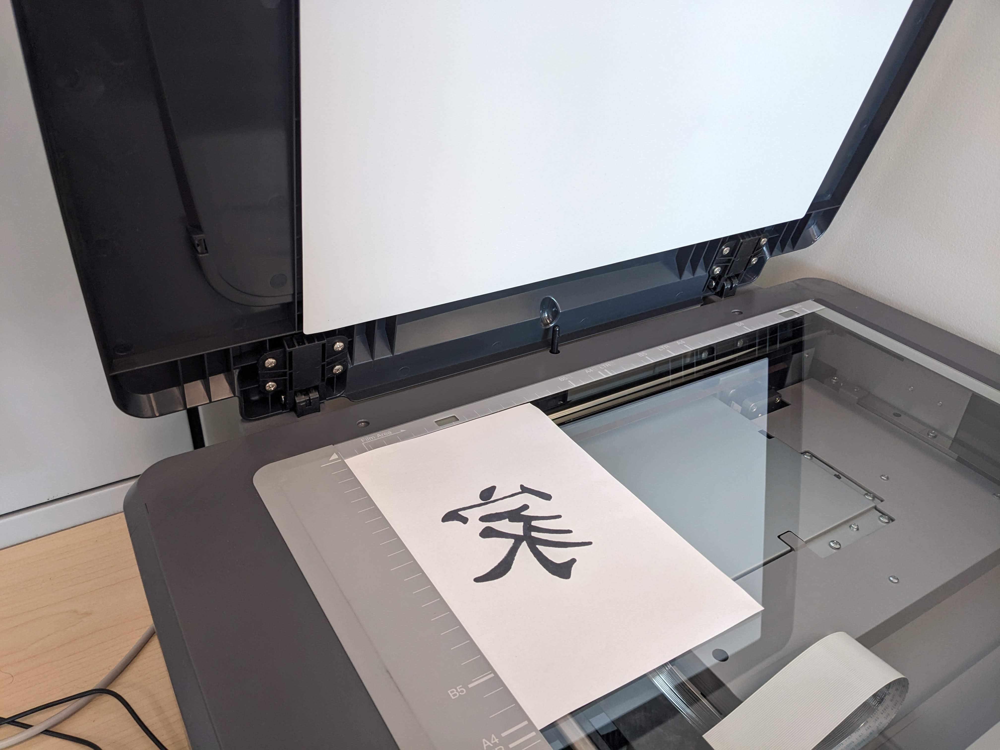
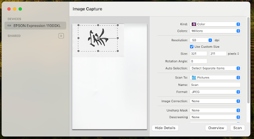

# From Print to Digital

If you and your group have any questions or get stuck as you work through this exercise, please ask the instructor for assistance.  Have fun!

## Digitizing Your Paper Art

1. Using a Camera
- Place your paper in a well lit area where you can take a photo without the camera casting a shadow across the paper. This can be on a table by a window in indirect light, or attached to a wall. You want to ideally have the paper look white and the art look dark and not have any parts where light is being reflected on the artwork, creating unintended highlights. If you are using a cell phone, you can also use a photo editor to make adjustments.
- Import your photo to the computer where Inkscape is installed.
  
2. Using a Scanner 
- Place your paper on the scanner bed.
- Follow the scanner instructions to scan. 
- Transfer your image to the computer where you will be using Inkscape if it is not the same computer.                                               

[NEXT STEP: Convert Image to Vector](edit-art.html){: .btn .btn-blue }
