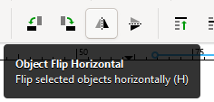

# Get your file ready for laser cutting 

1. Finalize your file for laser cutting
- Seals, like other types of stamps, need to be made using a mirrored design to ensure the correct orientation appears once the ink is applied. To mirror the design in Inkscape:  
  - Make sure all elements of your design are **selected**.
   
  - **Click** on **Object Flip Horizontal**. This will flip your design horizontally and is now ready to laser cut. 
  - Save your design and submit it for laser cutting. 

[NEXT STEP: Earn a Workshop Badge](informal-credentials.html){: .btn .btn-blue }
