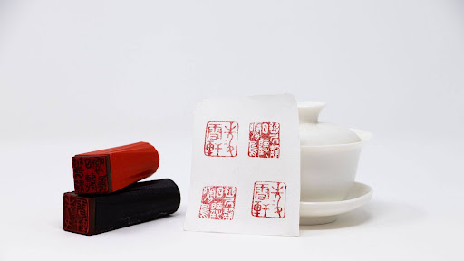

# Impressions without Carving 2: East Asian Seal Art and Modern Technology

- Pre-workshop activities: 15 min 
- Introductory presentation: 10 min
- Hands-on activities: 40-60 min

## Why learn about seal art? 

Seals have been used for centuries in many parts of the world but have gained popularity and even become necessities around multiple areas of Asia. Today, seals are still used in several countries and can hold the same legal power as a signature. Master caligraphers and seal carvers traditionally created these functional pieces of art by hands in different materials such as stone and hard woods. Today, only a few of these Masters remain, but technology, while never replacing the artists and their work, can make this art more accessible to more people. 

## What tools do we use?
- Inkscape is a free and open source design tool for making and editing vector graphics. Inkscape uses the standardized SVG file format as its main format, which is supported by many other applications including web browsers.
- Another design tool is Photopea, a free online image editor. You can export designs in several formats including .SVG.
- This workshop is not an endorsement of Inkscape or Photopea; there are many options for 2D design and other software may be better for different contexts or preferences.

## Learning objectives

At the end of this workshop, you will be able to:
1. Explain what a seal is and their function
2. Explain which materials are best for traditional and technology-made seals
3. Select appropriate 2D or 3D design software for laser applications
4. Digitize hand-drawn designs and importing them in the appropriate software for laser cutting
5. Create and modify 2D designs for engraving
6. Export designs to .svg file format
 
[NEXT STEP: Pre-Workshop Activities](pre-workshop.html){: .btn .btn-blue }
