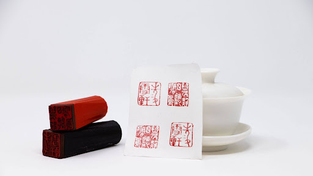

# Impressions without Carving 2: East Asian Seal Art and Modern Technology

- Pre-workshop activities: 15 min 
- Introductory presentation: 10 min
- Hands-on activities: 40-60 min

## Why learn about seal art? 

Seals have been used for centuries in many parts of the world but have gained popularity and even become necessities around multiple areas of Asia. Today, seals are still used in several countries and can hold the same legal power as a signature. Master caligraphers and seal carvers traditionally created these functional pieces of art by hand in different materials such as stone and hard woods. Today, only a few of these Masters remain, but technology, while never replacing the artists and their work, can make this art more accessible to more people. 

## What tools do we use?
- Inkscape is a free and open source design tool for making and editing vector graphics. Inkscape uses the standardized SVG file format as its main format, which is supported by many other applications including web browsers.
- Another design tool is Photopea, a free online image editor. You can export designs in several formats including .SVG.

## Learning objectives

During this workshop attendees will learn:
1. What a seal is and their function
2. Which materials are used for traditional and technology-made seals
3. Useful 2D or 3D design software for laser applications
4. How to convert designs and import them in the appropriate software for laser cutting
5. How to create and modify 2D designs for engraving
6. How to export designs to .svg file format
 
[NEXT STEP: Pre-Workshop Activities](pre-workshop.html){: .btn .btn-blue }
