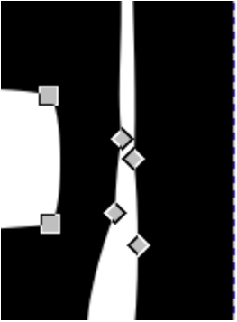
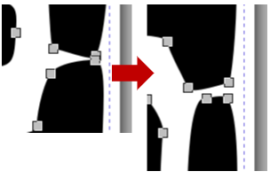
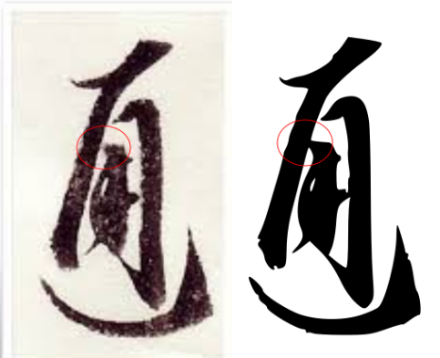

# Modify your Vector File

If you and your group have any questions or get stuck as you work through this exercise, please ask the instructor for assistance.  Have fun!

1. Clean up and/or Simplify artwork
- If the trace has resulted in an image with far too many details and/or nodes, you can go to the top menu and **click on Path** and then **Simplify**. This will further smooth out the outline of your image. If this process gets rid of too many details, you can undo it. 
- You can alternatively clean up the excess nodes manually, which gives you more control over the process.
- Click on the **Edit Path by Nodes tool** in the left toolbar and then click on your artwork. You should see all the little nodes (small squares along the outlines) in your artwork.
- **Click on the nodes** individually to select and then press the **Delete key** on your keyboard.
- You can also **drag the mouse** to select several at a time and **Delete** them.  
- Deleting some nodes may change the shape of your design in that area. If you click on nearby nodes, they will usually have little arms with round handles. 
- **Click and drag** on one of these circle handles to modify that segment of the artwork. 

- Note: leaving some imperfections is a good idea to mimic the natural look of a hand-engraved seal.

2. Separating elements:

- If some elements of your artwork got joined in the tracing process and you would like to separate them by **selecting the eraser tool** 
- Make sure that **“Cut out from path and shapes”** and **“Break apart cut items”** are selected. You can also adjust the width of the eraser as well as other settings at this stage. 
- **Cut through the desired area**, this will likely create a rough edge. If desired, use the simplify tool over the newly separated area or adjust the nodes manually.

3. Connecting elements:

- If elements of your artwork are separated and you would like them to touch:
- **Adjust the nodes manually** by right-clicking the necessary nodes and moving them to join the desired area. 
**OR**
- Use the **“freehand draw lines”** tools and draw the necessary connections manually. If desired,  use the simplify tool over the newly drawn area.  

4. Adding a cut line for your seal
- Let's add a cut line around your design, so that the laser knows where to cut your seal.
-  Click on the **create rectangles and squares** icon from the left side toolbar  
 - Click and drag somewhere on the canvas to create a rectangle. In the top left corner there’s a toolbar that looks like this:   
 - Make sure the units are in **mm**.
 - Change the width (W) and height (H) to **20**.  You should now have a 20mm x 20mm square shape.
 - Change the x-radius (Rx) and y-radius (Ry) to **1**.  This determines how rounded the corners of your square are.
 -  - Click on the **Object** drop-down menu and select **Fill and Stroke**. A tool on the right side of the screen should pop-up.  
 - In the **Fill** tab, change the fill from Flat colour to No paint.
 - Click over to the **Stroke paint** tab. Select **Flat colour**. The vector cutting colour is a specific red in the laser software. In the RGB colour selection, Change the red (R) value to 255 and change the green (G) and blue (B) values to 0. 
 - Click over to the **Stroke style** tab. Change the Width to 0.1 mm. This is to ensure the line is thin enough to show up as a vector line in the laser software. Sometimes if lines are too thick then they’re interpreted as raster objects.

5. Mirror your design
- Seals, like other types of stamps, need to be made using a mirrored design to ensure the correct orientation appears once the ink is applied. To mirror the design in Inkscape:  
- **Make sure all elements of your design are selected**.

 
- **Click** on **Object Flip Horizontal**. This will flip your design horizontally and is now ready to laser cut. 

- **Save** before continuing to make sure you don’t lose the progress in your work.
- Click File, then Save As… to save your file. Rename if desired.

[NEXT STEP: Earn a Workshop Badge](informal-credentials.html){: .btn .btn-blue }
