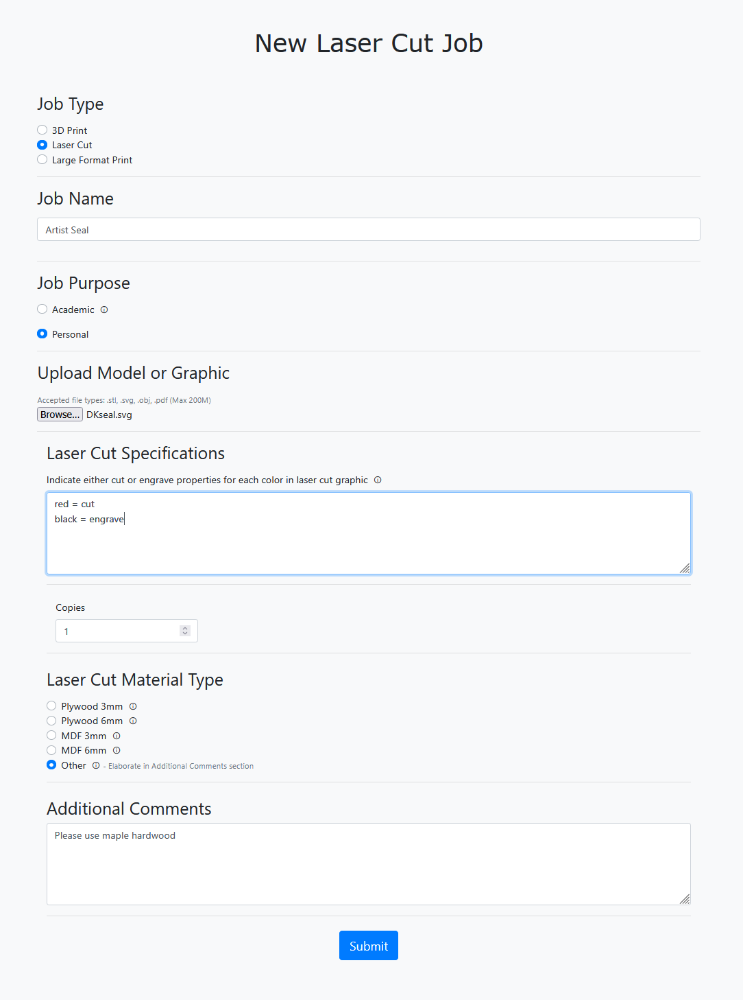
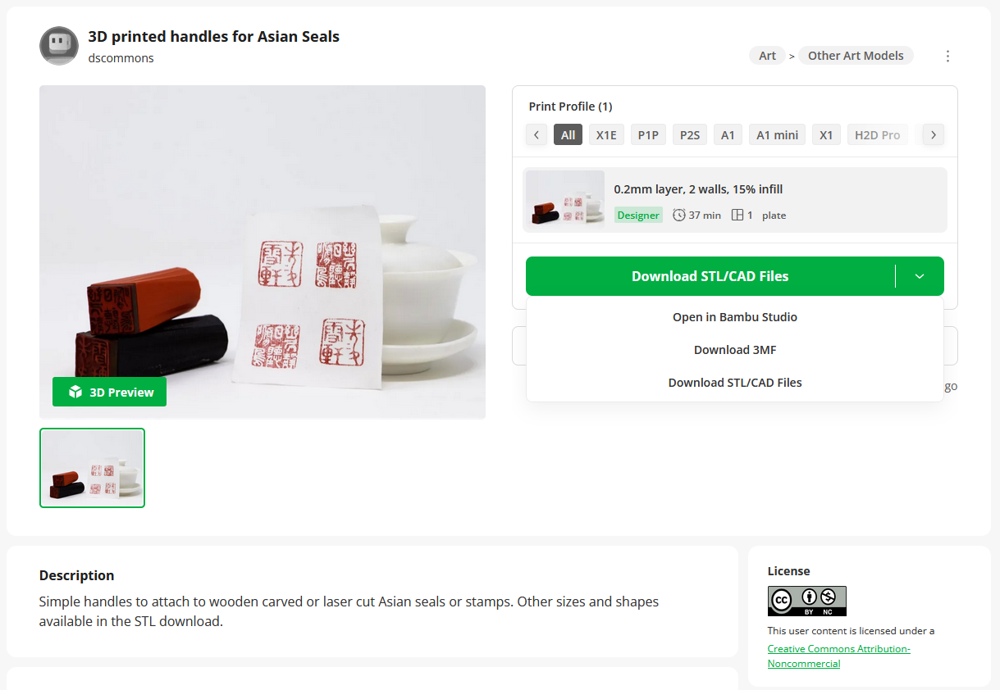

# Requesting a Laser Cut Seal with a 3D Printed Handle
If you and your group have any questions or get stuck as you work through this exercise, please ask the instructor for assistance.  Have fun!

1. Submit a laser cut request:
- Go to our [Online Request Form](https://webapp.library.uvic.ca/3dprint/customer-dashboard.php){:target="_blank"} and sign in with your UVic NetlinkID.
- Upload the SVG file you created for your seal
- Fill out the form with the settings you want (feel free to consult with our staff regarding these details). Wood choice influences the durability of your seal. A soft wood, such as plywood, works well for seals that you don’t plan on using for a very long time since the design will start to deteriorate. A hard wood, such as solid maple, will hold up for much longer and therefore is a better choice to ensure longevity.

2. Choose a handle for your seal:

- If you want a 3D printed handle, we have uploaded some that are ready to print at various sizes on [Makerworld.com](https://makerworld.com/en/models/2100956-3d-printed-handles-for-asian-seals){:target="_blank"}.
- Click on the drop-down to select the option to **Download STL/CAD files** and this will download a zip file of all the sizing options.

3. Submit a 3D printing request:

- Go to our [Online Request Form](https://webapp.library.uvic.ca/3dprint/customer-dashboard.php){:target="_blank"} and sign in with your UVic NetlinkID.
- Upload the STL file you chose for your seal
- You can leave the default settings.

Note for Alumni and Community Users: How to Request Laser Cutting and 3D Printing Without a NetlinkID
- Email us a dscommons@uvic.ca with your request and files
- We will let you know the total cost and create a paper form for you to pick up in our department on the 3rd floor in our Reception Office in room A318, and you can pay at the McPherson Library Ask Us Desk located near the entrance on the first floor. They will staple your receipt to the form and you can drop the form and receipt back up to our DSC Reception Office on the 3rd floor so that we know that your request has been paid for.
- Once we receive that receipt, we will add your project to our queue and then email you when it's ready to pick up.

[NEXT STEP: Bonus: From Yin to Yang](bonus.html){: .btn .btn-blue }
